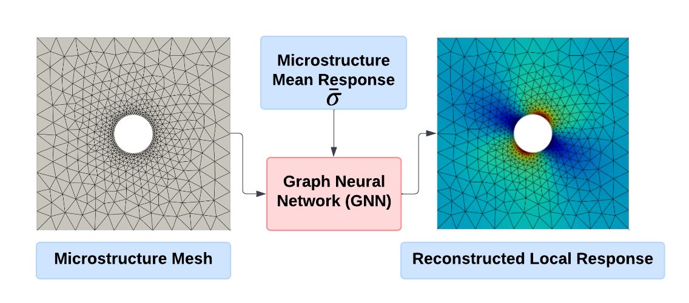

# 🌐 P-DivGNN: Physics-Informed Graph Neural Networks for Local Field Reconstruction Considering Finite Strain Hyperelasticity

[](LICENSE)
[](https://www.python.org/)
[](https://ubuntu.com/)



Official repository for the paper:

> **Physics-Informed Graph Neural Networks to Reconstruct Local Fields Considering Finite Strain Hyperelasticity**

This work proposes **P-DivGNN**, a physics-informed graph neural network tailored for accurately reconstructing mechanical fields in materials undergoing large deformations using elastic and hyperelastic constitutive models.

---

## 🚀 Highlights

* Finite-strain hyperelasticity field reconstruction using GNNs.
* Support for linear elastic and non-linear hyperelastic datasets.
* Comparison of different GNN-based model variants (P-DivGNN, P-GNN, standard GNN).
* FEM-based dataset generation with [Fedoo](https://github.com/3MAH/fedoo) and [Simcoon](https://github.com/3MAH/simcoon).

---

## 🧰 Installation

Tested on **Ubuntu 24.04** and **CUDA 12.4**.

We recommend setting up a new Python environment using [Conda](https://docs.conda.io/):

```bash
conda create -n pdivgnn python=3.12
conda activate pdivgnn
# Only required for hyperelastic dataset
conda install -c conda-forge -c set3mah simcoon
pip install .
```


---

## 📦 Dataset Generation

Navigate to the `scripts/` directory.

### 🔧 Dependencies

Make sure [Fedoo](https://github.com/3MAH/fedoo) and [Simcoon](https://github.com/3MAH/simcoon) are installed for dataset generation.

### ▶️ Linear Elastic Dataset

```bash
python3 generate_dataset.py \
  --n_samples 10000 \
  --test_size 0.3 \
  --dataset_path dataset_10k_elast/
```

### ▶️ Non-Linear Hyperelastic Dataset

```bash
python3 generate_dataset_hyperelast.py \
  --n_samples 10000 \
  --test_size 0.3 \
  --dataset_path dataset_10k_hyperelast/
```

---

## 📚 Training

You can configure training parameters in the `.yml` files under `configs_train/`.

From `scripts/`:

### 🔁 Linear Elastic Training

```bash
# P-DivGNN
python3 gnn_train.py --config_path configs_train/config_train_div.yml

# P-GNN
python3 gnn_train.py --config_path configs_train/config_train_no_div.yml

# GNN (no periodic edges)
python3 gnn_train.py --config_path configs_train/config_train_no_periodic.yml
```

### 🔁 Hyperelastic Training

```bash
# P-DivGNN
python3 gnn_train.py --config_path configs_train/config_train_div_hyperelast.yml

# P-GNN
python3 gnn_train.py --config_path configs_train/config_train_no_div_hyperelast.yml
```

---

## 🔎 Inference

From `scripts/`:

### 🧪 Linear Elastic Inference

```bash
python3 gnn_inference.py --config_path configs_inference/config_inference_div.yml
python3 gnn_inference.py --config_path configs_inference/config_inference_no_div.yml
python3 gnn_inference.py --config_path configs_inference/config_inference_no_periodic.yml
```

### 🧪 Hyperelastic Inference

```bash
python3 gnn_inference.py --config_path configs_inference/config_inference_div_hyperelast.yml
python3 gnn_inference.py --config_path configs_inference/config_inference_no_div_hyperelast.yml
```

---

## 📊 Result Comparison

To reproduce the figures used in the paper:

### 📈 Linear Elastic Comparison

```bash
# P-DivGNN vs P-GNN
python3 compare_results.py \
  --figures_folder plots_elast \
  --proposed_model_folder inferences_elast/P-DivGNN \
  --baseline_model_folder inferences_elast/P-GNN \
  --ground_truth_csv dataset_10k_elast/test/dataset.csv \
  --topk 50

# P-GNN vs GNN
python3 compare_results.py \
  --figures_folder plots_elast \
  --proposed_model_folder inferences_elast/P-GNN \
  --baseline_model_folder inferences_elast/GNN \
  --ground_truth_csv dataset_10k_elast/test/dataset.csv \
  --topk 50
```

### 📈 Hyperelastic Comparison

```bash
# P-DivGNN vs P-GNN
python3 compare_results.py \
  --figures_folder plots_hyperelast \
  --proposed_model_folder inferences_hyperelast/P-DivGNN \
  --baseline_model_folder inferences_hyperelast/P-GNN \
  --ground_truth_csv dataset_10k_hyperelast/test/dataset.csv \
  --topk 50

# P-GNN vs GNN
python3 compare_results.py \
  --figures_folder plots_hyperelast \
  --proposed_model_folder inferences_hyperelast/P-GNN \
  --baseline_model_folder inferences_hyperelast/GNN \
  --ground_truth_csv dataset_10k_hyperelast/test/dataset.csv \
  --topk 50
```

---

## 🧪 FEM vs GNN Benchmark

```bash
# For linear elasticity
python3 benchmark_gnn_fem.py --hyperelastic False

# For hyperelasticity
python3 benchmark_gnn_fem.py --hyperelastic True
```

---

## 📄 Citation

If you find this project useful, please consider citing the corresponding paper:

```bibtex
@article{pdivgnn2025,
  title={Physics-Informed Graph Neural Networks to Reconstruct Local Fields Considering Finite Strain Hyperelasticity},
  author={M. Guevara Garban, Y. Chemisky, E. Prulière, M. Clément},
  journal={International Journal for Numerical Methods in Engineering},
  year={2025},
  doi={XXXXXXX}
}
```

---

## 📬 Contact

For questions or contributions, feel free to open an issue or contact [@ricardo0115](https://github.com/ricardo0115).
